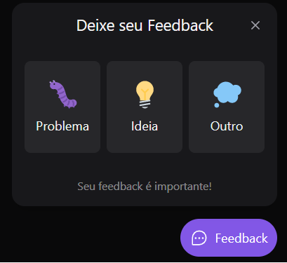

<h1 align="center">
    
</h1>

<h4 align="center">
  Next Level Return Impulse
</h4>

<p align="center">
  <a href="#rocket-tecnologias"> :rocket: Tecnologias</a>&nbsp;&nbsp;&nbsp;|&nbsp;&nbsp;&nbsp;
  <a href="#-projeto">💻 Projeto</a>&nbsp;&nbsp;&nbsp;|&nbsp;&nbsp;&nbsp;
  <a href="#-como-executar">🔖 Como Executar</a>&nbsp;&nbsp;&nbsp;
</p>

<br>

## :rocket: Tecnologias

Este projeto contém as seguintes tecnologias:

- [React](https://reactjs.org)
- [Node.js](https://nodejs.org/en/)
- [Express](https://expressjs.com/pt-br/)
- [TypeScript](https://www.typescriptlang.org/)
- [TailWild](https://tailwindcss.com)
- [HeadlessUI](https://headlessui.dev)
- [Prisma](https://www.prisma.io)
- [Vite](https://vitejs.dev)
- [Sqlite3](https://www.sqlite.org/index.html)

## 💻 Projeto

O Feedget é uma aplicação desenvolvida como um widget para Feedbacks. É uma maneira do usuário enviar seus feedbacks para os donos do site de maneira muito simples e fácil. A aplicação armazena os feedbacks em um banco de dados e também envia um e-mail para o dono, notificando das ações.

## 🔖 Como Executar

#### Clonando o projeto
```sh

git clone https://github.com/LeonardoGarbelotti/nlw-return-impulse.git

```
#### Instalação
No seu terminal, siga as instruções abaixo para instalar as dependência no projeto.
```sh

npm install dependencies

```

#### Criando o banco de dados
Dentro da pasta *server*, executar: 
```sh

npx prisma migrate dev

```
#### Iniciando a aplicação
```sh

cd web
npm run dev

```